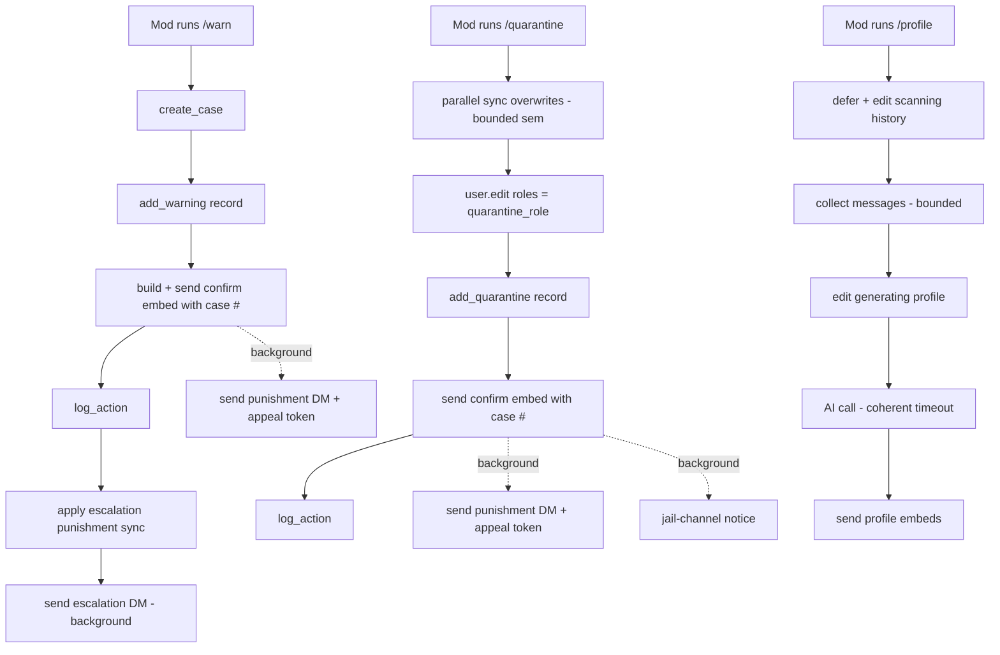

# Plan: Fix `/profile` hang/error + speed up `/warn` and `/quarantine`

## Problem statements

### 1. `/profile` — "keeps running then an error"
File: [`cogs/behavior_profiling.py`](cogs/behavior_profiling.py:1)

Two compounding issues in [`profile_user`](cogs/behavior_profiling.py:511):

- **Broken timeout math.** The AI call is wrapped in
  [`asyncio.wait_for(..., timeout=PROFILE_TIMEOUT_SECONDS)`](cogs/behavior_profiling.py:464)
  with `PROFILE_TIMEOUT_SECONDS = 90`. But the function it wraps,
  [`_call_aimodel`](cogs/aimoderation/ai_client.py:861), iterates over multiple
  candidate models, each calling
  [`_post_responses_api`](cogs/aimoderation/ai_client.py:758) with
  `max_retries=1` and `request_timeout` up to 60s
  ([`_aimodel_request_timeout`](cogs/aimoderation/ai_client.py:179)), plus
  exponential backoff between retries. Worst case internal budget for a single
  model: `2 * 60s + backoff ≈ 121s` — already past the 90s outer cap — and
  failover then tries the next model on top. Under any provider degradation the
  outer `wait_for` fires `asyncio.TimeoutError` after the call has already been
  grinding for ~90s, surfacing as "Profile Timed Out" or, if a non-timeout
  exception escapes first, "Profile Failed"
  ([handler](cogs/behavior_profiling.py:643)). This matches the reported
  "keeps running then an error".
- **No progress feedback + unbounded history scan.** After
  [`interaction.response.defer(..., thinking=True)`](cogs/behavior_profiling.py:570)
  there is no update until the very end. When the DB has fewer than
  `PROFILE_TARGET_MESSAGES` (500) tracked messages,
  [`_collect_messages`](cogs/behavior_profiling.py:404) falls back to
  [`_history_messages`](cogs/behavior_profiling.py:382), which scans every
  accessible text channel up to `HISTORY_SCAN_PER_CHANNEL = 1000` messages each
  with only `HISTORY_SCAN_CONCURRENCY = 3` concurrent
  ([constants](cogs/behavior_profiling.py:34)). On a large server this is a
  long silent hang before the AI call even starts.

### 2. `/warn` — slow to confirm
File: [`cogs/moderation/extensions/warnings.py`](cogs/moderation/extensions/warnings.py:1)

In [`_warn_logic`](cogs/moderation/extensions/warnings.py:12) the moderator's
confirmation embed
([`self._respond(source, embed=embed)`](cogs/moderation/extensions/warnings.py:60))
does not fire until after this serial chain:
`create_case` → `send_punishment_notice` (a DM plus an appeal-token DB
transaction in [`notify_punishment`](cogs/appeals.py:195)) → `add_warning` → a
redundant `get_warnings` re-read → embed build → respond. The DM/appeal-token
step runs *before* the warning is even recorded, so the mod waits on a network
round-trip + DB transaction that is not essential to confirming the warning
landed. Escalation
([`apply_warning_escalation`](utils/warning_escalation.py:162)) then runs
after the respond, which is correct ordering for showing the escalation
outcome, but it also performs its own DM before the punishment.

### 3. `/quarantine` — slow to confirm
File: [`cogs/moderation/extensions/management.py`](cogs/moderation/extensions/management.py:1)

In [`_quarantine_logic`](cogs/moderation/extensions/management.py:939) the
actual isolation
([`user.edit(roles=[quarantine_role], ...)`](cogs/moderation/extensions/management.py:1013))
happens only after:
[`_sync_quarantine_overwrites`](cogs/moderation/extensions/management.py:51)
loops every guild channel with a **serial**
[`channel.set_permissions`](cogs/moderation/extensions/management.py:87) HTTP
call (50 channels = 50 sequential requests), plus DM-channel prep, case
creation, and the appeal-token transaction. The overwrite sync is idempotent
and already skips channels that match the restricted overwrite, yet it runs in
full on every quarantine invocation.

## Chosen approach

**Hybrid: background non-critical side-effects, parallelize the one step that
cannot be deferred.**

- `/warn`: keep `create_case`, `add_warning`, the confirm embed, `log_action`,
  and the escalation *punishment* synchronous so the mod sees the real case #
  and the escalation outcome immediately. Background the punishment DM +
  appeal-token transaction (and the escalation DM). This is the biggest
  latency win with no loss of authoritative feedback.
- `/quarantine`: keep `create_case`, `user.edit(roles=...)`, `add_quarantine`,
  the confirm embed, and `log_action` synchronous so isolation and the case #
  are authoritative. **Parallelize** the overwrite sync with a bounded
  concurrency semaphore (it cannot be deferred without a containment gap,
  because `user.edit(roles=[quarantine_role])` strips the user's normal roles
  but channels relying on `@everyone` view remain visible until the per-channel
  denies are applied). Background the DM + appeal-token transaction and the
  jail-channel notice.
- `/profile`: fix the timeout coherence, add progress edits, and bound the
  history scan.

A containment gap is acceptable for the DM (user already punished) but **not**
for channel visibility, which is why the overwrite sync is parallelized rather
than backgrounded.

## Architecture

## Detailed changes

### A. Shared background-side-effect helper (new, small)
Add a tiny helper in `utils/` (e.g. `utils/async_tasks.py`) exposing
`fire_and_forget(coro, *, name, logger)` that wraps `asyncio.create_task` with
a `done_callback` that logs any exception. This mirrors the existing
fire-and-forget pattern used in
[`cogs/aimoderation/ai_client.py`](cogs/aimoderation/ai_client.py:2021) and
[`cogs/logging_cog.py`](cogs/logging_cog.py:1551) but centralizes the
error-logging callback so backgrounded side-effects fail visibly in logs
instead of silently. All backgrounded steps below go through this helper.

### B. `/profile` — [`cogs/behavior_profiling.py`](cogs/behavior_profiling.py:1)
1. **Coherent timeout.** In
   [`_generate_profile`](cogs/behavior_profiling.py:453), pass `max_retries=0`
   and a single primary model (no failover list) into `_call_aimodel`, with a
   per-request timeout (e.g. 60s via the existing
   [`_aimodel_request_timeout`](cogs/aimoderation/ai_client.py:179) default)
   so the inner budget (~60s) is strictly less than the outer
   `PROFILE_TIMEOUT_SECONDS`. Raise `PROFILE_TIMEOUT_SECONDS` to 75s to give
   headroom. Net effect: a degraded provider fails deterministically at ~60s
   instead of grinding past 90s and then throwing a misleading timeout. Keep
   the existing `asyncio.TimeoutError` and generic-exception handlers.
2. **Progress feedback.** After
   [`defer`](cogs/behavior_profiling.py:570), immediately
   `await interaction.edit_original_response(embed=ModEmbed.info("Scanning History", ...))`
   before `_collect_messages`, and edit again to "Generating Profile" before
   `_generate_profile`. Use `interaction.edit_original_response` (safe after a
   deferred thinking response) wrapped in try/except so a failed edit never
   breaks the command.
3. **Bound the history scan.** In
   [`_history_messages`](cogs/behavior_profiling.py:382) / `_collect_messages`:
   cap the number of channels scanned (e.g. top N by `last_message_id` already
   sorted by [`_accessible_channels`](cogs/behavior_profiling.py:328)) and wrap
   the gather in an overall `asyncio.wait_for` budget (e.g. 20s) so a huge
   server cannot make the scan open-ended. On scan timeout, proceed with
   whatever was collected (plus DB messages) as long as it meets
   `MIN_PROFILE_MESSAGES`.

### C. `/warn` — [`cogs/moderation/extensions/warnings.py`](cogs/moderation/extensions/warnings.py:12)
Reorder [`_warn_logic`](cogs/moderation/extensions/warnings.py:12) to:
1. `can_moderate` check (unchanged).
2. `create_case` (unchanged — mod needs the real case #).
3. `add_warning` (move **up**, before any DM). Drop the redundant
   `get_warnings` re-read that immediately follows it; use the `warn_count`
   already returned by `add_warning` for the embed's "Total Warnings" field.
4. Build + send the confirm embed (this is now the first thing the mod sees,
   right after the DB writes).
5. `log_action`.
6. **Background** the punishment DM + appeal-token transaction by wrapping the
   existing `send_punishment_notice(...)` call in `fire_and_forget`.
7. Run escalation: keep `apply_warning_escalation` synchronous for the
   *punishment* (`timeout`/`kick`/`ban`) so the mod sees the auto-action
   outcome, but background the escalation DM that
   [`apply_warning_escalation`](utils/warning_escalation.py:196) sends. This
   requires either a flag on `apply_warning_escalation` to skip its internal DM
   (and we send that DM via `fire_and_forget` from `_warn_logic`), or wrapping
   the whole escalation call in `fire_and_forget` if the mod does not need to
   see the escalation result inline. **Recommended:** keep the punishment
   synchronous, background only the DMs — implement by adding an optional
   `skip_dm: bool = False` param to `apply_warning_escalation` and sending the
   escalation DM via `fire_and_forget` from `_warn_logic` using the returned
   [`WarningEscalationResult`](utils/warning_escalation.py:32).

### D. `/quarantine` — [`cogs/moderation/extensions/management.py`](cogs/moderation/extensions/management.py:939)
1. **Parallelize
   [`_sync_quarantine_overwrites`](cogs/moderation/extensions/management.py:51).**
   Replace the serial `for channel in guild.channels` loop with a
   `asyncio.gather` over per-channel `set_permissions` calls gated by an
   `asyncio.Semaphore(5)` (5–8 is a safe Discord HTTP concurrency). Keep the
   idempotent skip (`current_overwrite == restricted_overwrite`) so already-
   synced channels add zero HTTP calls. This cuts 50 sequential requests to
   ~10 batches while staying synchronous (no containment gap).
2. **Reorder [`_quarantine_logic`](cogs/moderation/extensions/management.py:939)
   to:** `can_moderate` + `can_bot_moderate` → resolve quarantine role →
   compute duration → `create_case` → `_sync_quarantine_overwrites`
   (parallelized) → `_backup_roles` → `user.edit(roles=[quarantine_role])` →
   `add_quarantine` → build + send confirm embed (with case #, channel-sync
   counts, roles removed) → `log_action`.
3. **Background** the punishment DM + appeal-token transaction
   ([`send_punishment_notice`](cogs/moderation/extensions/helpers.py:292)) and
   the jail-channel notice
   ([`jail_channel.send`](cogs/moderation/extensions/management.py:1073)) via
   `fire_and_forget`. The confirm embed reaches the mod as soon as the user is
   actually isolated + recorded, not after the DM round-trip.

### E. Deployment (per AGENTS.md §5)
1. `scp` changed files to `root@docketbot.xyz:/root/modbot/...`.
2. `ssh root@docketbot.xyz` and restart the PM2 process (check all running
   processes; password `Pokem0n2020nero`).
3. Run `.\update.bat` locally to commit + push to GitHub.

## Files touched
- `utils/async_tasks.py` (new) — `fire_and_forget` helper.
- [`cogs/behavior_profiling.py`](cogs/behavior_profiling.py:1) — timeout coherence, progress edits, bounded scan.
- [`cogs/moderation/extensions/warnings.py`](cogs/moderation/extensions/warnings.py:1) — reorder + background DMs.
- [`cogs/moderation/extensions/management.py`](cogs/moderation/extensions/management.py:1) — parallelize overwrites, reorder, background DM/jail notice.
- [`utils/warning_escalation.py`](utils/warning_escalation.py:162) — optional `skip_dm` param on `apply_warning_escalation`.

## Non-goals
- No changes to the AI provider selection, model names, or routing outside the
  profile path.
- No changes to the quarantine role resolution, duration parsing, or DB schema.
- No changes to logging content — only timing/ordering of the log send.
